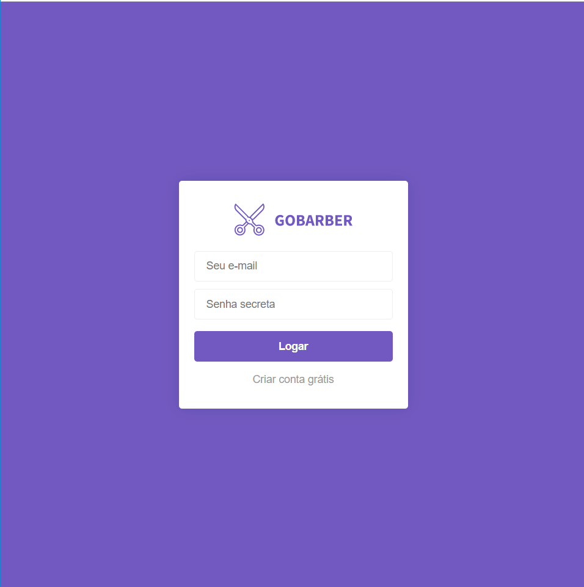
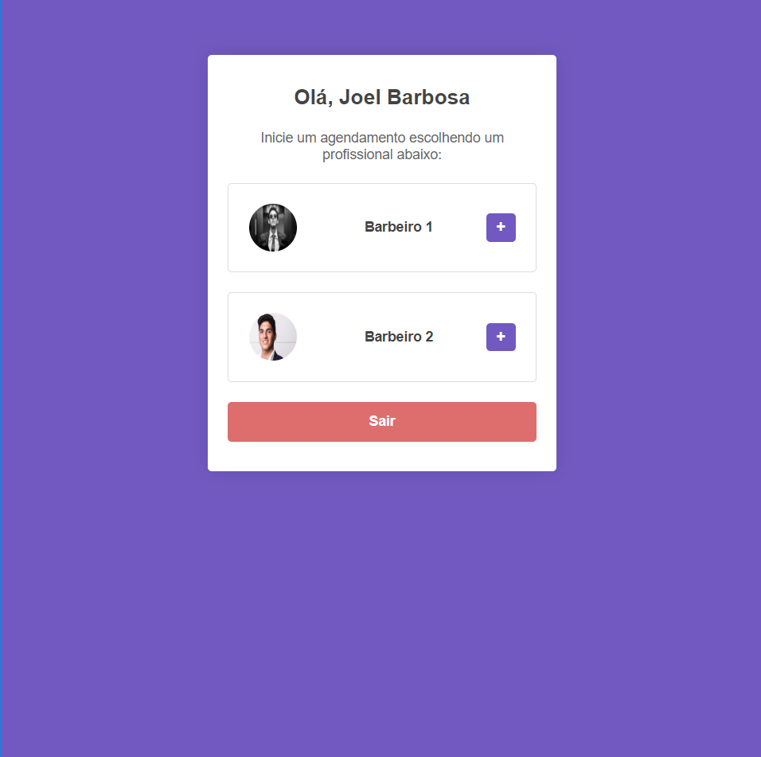
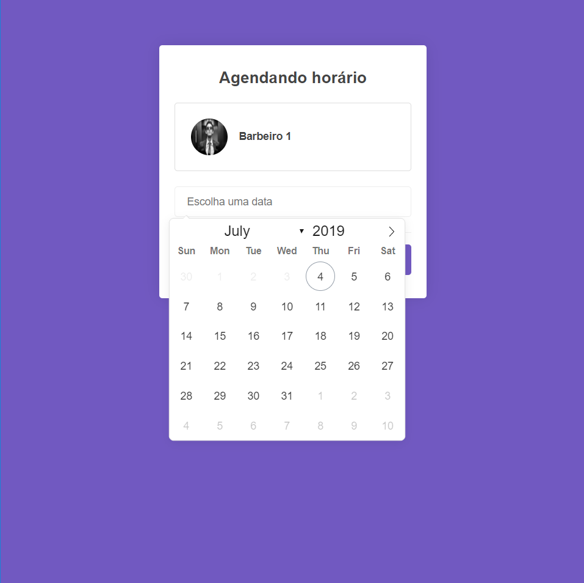
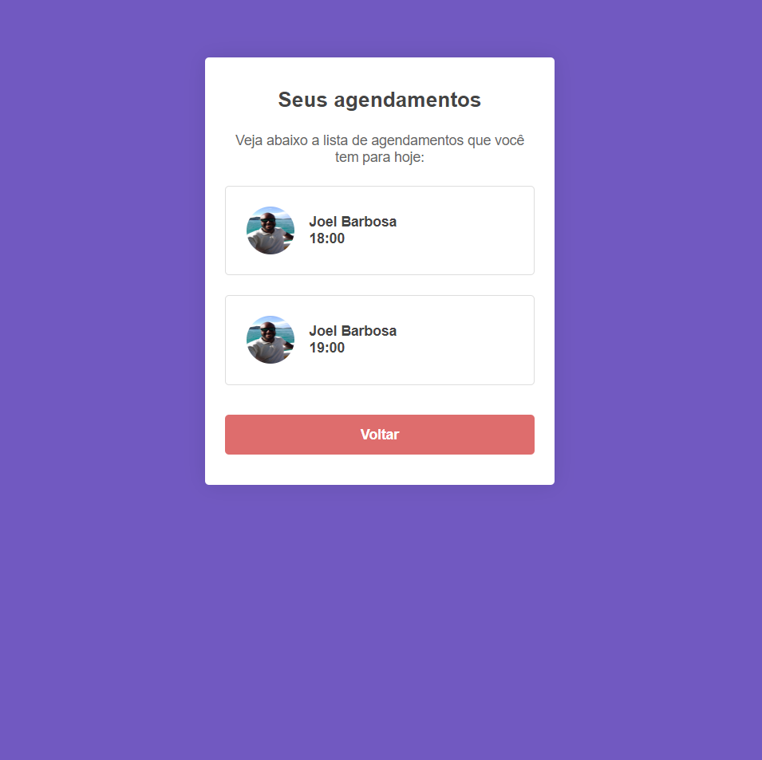

# GoBarber ✂️

## Rodando o projeto

> Baixe ou clone este repositório.
>
> Vocé pode escolher qualquer banco de dados, devendo somente fazer as devidas alterações no arquivo database.js dentro da pasta config, assim como valores referente ao ambiente (usuario, host, etc).

> Rode o comando abaixo, para realizar as migrations, assim o Sequelize irá criar as tabelas necessárias para o projeto no banco de dados:

`npx sequelize db:migrate`

> Acesse a raiz do projeto por um console e execute:

- `yarn ou npm i` para instalar as dependências do projeto
- `yarn start ou npm start` para rodar a aplicação no localhost

## Sobre o projeto: 📃

O objetivo era desenvolver um simples sistema de agendamento para cortes de cabelo online utilizando Node.js e Nunjucks.

## Requisitos do projeto: ✅

- Login

A página incial seria a tela de login do usuário.

- Cadastro de usuários

Uma página contendo um formulário para se cadastrar como usuário, podendo escolher também ser prestador de serviço(Barbeiro).

- Dashboard

Página onde seria possível ver os prestadores de serviços cadastrados, escolher um para ver as datas e horários disponiveis, caso o usuário for um prestador de serviços, ele teria um botão para ver os agendamentos que ele possui.

- Agendamento

Após escolher um prestador de serviços, o usuário pode ver as datas que ele tem disponivel.
Ao escolher uma data ele vê os horários disponiveis.

- Agendamentos marcados

O prestador de serviços pode ver os agendamentos que ele possui.

## Frameworks e Tecnologias Utilizadas: 🌌

### Front-End: 🎨

- <strong>CSS</strong> (Estilização)
- <strong>Nunjucks</strong> (Template engine)

### Backend: 💾

- <strong>Node.Js</strong> & o Framework <strong>Express.Js</strong>
- <strong>MySQL</strong> (Banco de dados)
- <strong>Sequelize</strong> (ORM)
- <strong>Multer</strong> (Upload de imagens)

## Imagens: 📷

### <strong>login:</strong>

### <strong>Dashboard:</strong>

### <strong>Agendamento:</strong>

### <strong>Tela do barbeiro para ver seus agendamentos marcados:</strong>

